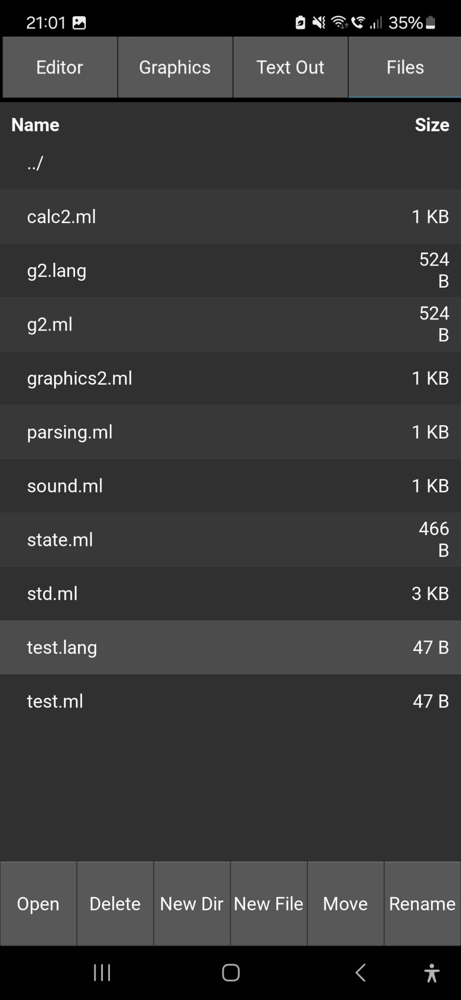
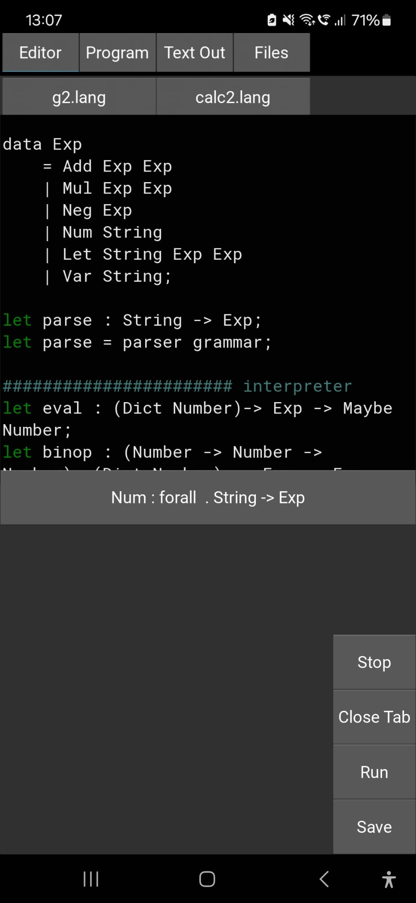
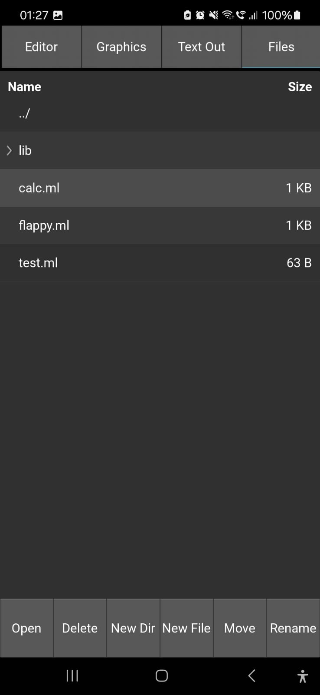

# Pocket ML 📱

PocketML is a functional statically-typed language designed for
tinkering / small projects. Its main feature is the editor android app.
Use PocketML to kill boredom while waiting for the bus
or during a boring lecture! The language is similar to Standard-ML
and has python-interop, as well as support for numpy and kivy GUI. I recommend using the AnySoftKeyboard app, to make navigating code and inserting tabs easier.

## Specifications

> Section 1 may not be very helpful to you,
it serves mainly as an overview of the
details of the Language. To get into
PocketML, skip to section 2 (The Language Guide)!

#### 1.1 Syntax
> The syntax of the features of
PocketML is detailed in section 2 using examples.

PocketML`s syntax is largely based on Standard-ML
and Haskell. Some quirks include:
- Separation of top-level statements using `;`
```sml
let a = 10;
let b = 20;
print (a + b)
```
- Comments using `#`
```python
# i am a comment
```

#### 1.2 Type system

PocketML has a set of builtin types:
Vec (numpy arrays), Number, String, Bool, Tuples,
Lists, Dict and Maybe.

The operators *, /, +, - support
addition of strings, numbers, and Vecs,
as long as both sides of the operator
have the same type. The ° operator acts the
same as *, but allows two different types to
be multiplied (i.e. vector-scalar multiplication,
string multiplication, etc.).

<table border=3>
<tr><td>Operator</td><td>Type</td></tr>
<tr><td>+,-,*,/</td><td>a -> a -> a</td></tr>
<tr><td>°</td><td>a -> b -> a</td></tr>
</table>

#### 1.2.1 Builtins:

<table border=3>
<tr><td>Function</td><td>Type</td></tr>
<tr><td>and,or</td><td>Bool -> Bool -> Bool</td></tr>
<tr><td>add,sub,mul,pow</td><td>Number -> Number -> Number</td></tr>
<tr><td>sqrt, inc, dec</td><td>Number -> Number</td></tr>
<tr><td>True, False</td><td>Bool</td></tr>
<tr><td>equal</td><td>a -> a -> Bool</td></tr>
<tr><td>lt</td><td>Number -> Number -> Bool</td></tr>
<tr><td>print</td><td>a -> ()</td></tr>
<tr><td>print2</td><td>a -> b -> ()</td></tr>
</table>

## Language Guide

#### 2.1 Data Types
PocketML uses Sum types like most other statically 
typed functional languages:
```haskell
data Maybe a
    | Just a
    | Nothing
```

Type aliases can be used to abbreviate
the names of other data types:
```sml
type Mb a = Maybe a;
```

#### 2.2 Pattern Matching
Pattern matching is based on the `case` keyword
and can match basic data types:
```sml
case 1
    | 1 -> "One"
    | _ -> "Something else"
```
And many other structure (except for numpy arrays):
```sml
case Just 1
    | Just x -> print x
    | Nothing -> ()
```
Note that `()` represents the unit value of type `Unit`.

#### 2.3 Lists
Lists can be created like in the following example:
```python
import std;

print (list (1,2,3))
# => (Cons 1 (Cons 2 (Cons 3 Nil)))
```

Numpy arrays can be created using the `[1, 2, 3, ...]` syntax:
```python
print ([1, 2] + [3, 4]) # => [4. 6.]
```

#### 2.4 Tuples and Records
PocketML supports both tuples and records. It is
best to use records and tuples sparingly,
as custom data types carry more information
and are more strongly typed.
```sml
type Point = (Number, Number);

type Person =
    { name: String
    , age: Number
    , location: Point };
```

> Note that PocketML does not support tuple and record pattern
matching yet!

#### 2.5 Functions, recursion and let
Variables are generally introduced using the `let`
keyword. Let declarations can be used to introduce
a variables type before defining it:
```sml
let pi : Number;
let pi = 3;
```

Functions can be introduced using `\` and are
anonymous. To create recursive functions, 
the `rec` keyword or an explicit type
annotation is required:

```sml
let rec sum = \x -> case x
    | Nil -> 0
	| Cons x xs -> add x (sum xs);

print (sum (list (1,2,3,4)))
```
Or alternatively:
```sml
let sum : (List Number) -> Number
let sum = \case
    | Nil -> 0
	| Cons x xs -> add x (sum xs);

print (sum (list (1,2,3,4)))
```
>Note: The above example also uses the `\case` notation
which is equivalent to `\x -> case x ...`.


#### 2.6 Modules
PocketML projects are organized into files
which contain either scripts or modules.
A script exports no variables and _does something_.
A module additionally exports variables, types
and type aliases:

```sml
let greet = \x -> print2 "Hi," x;
let pi = 4;
module (greet, pi)
```
Modules can also use `(*)` to export *all*
types and variables.

```sml
let greet = \x -> print2 "Hi," x;
let pi = 4;
module (*)
```
Modules inside a directory can be addressed using `.`:
```python
import directory.mymodule;
```

#### 2.7 Python interop
PocketML is an interpreted language based on python. It
has access to all features of python and the
libraries `numpy`, `pygments`, `lark`, and `kivy`.
Python code can be included in Lang code using
`%% ... %%`. The `__EXPORTS__` variable
can be used to transfer data from python
to Lang:

```sml
%%
def half(x):
    return x / 2
__EXPORTS__ = {"half": half}
%%;

let half : Number -> Number;

print (half 2)
```
Python code can also be used to compute values
in PocketML code using the inline `% ... %` syntax.
Python types are largely compatible with PocketML types.
```sml
print %f"PocketML does not have f-strings but python does {'!'*10}"%
```
>Note: Python does not have access to variables from
PocketML!

#### 2.8 The editor

##### GUI
A large part of PocketML is its editor.
Use the `Editor` tab in the top toolbar
to edit files. Results show up in either
the `Program` tab for graphics or the `Text Out`
tab for text output. Open, delete files and folders
in the `Files` tab. For advanced file management
use a File manager app that can access the
`InternalStorage/Android/data/org.myapp.test/files/`
directory.
The info box above the keyboard shows the type
of the symbol the cursor is on when clicked.

##### Extending and hacking!
PocketML`s editor is accessible from Python (see 2.7).
Use the following template to gain access to
the editor object. It contains the "terminalout"
and "graphicalout" objects.
```python
%%
EDITOR = self.env["editor"]
def cls(_):
    # clears the terminal
	global EDITOR
	EDITOR.terminalout.text = ""
%%;
()
```
To see Python-Editor interop in action, refer
to the `graphics2.ml` library and the source code.

## Screenshots



<br>

<video src="assets/3.mp4" width="40%" controls>
