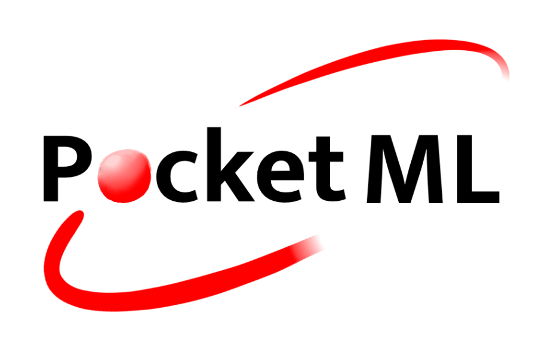
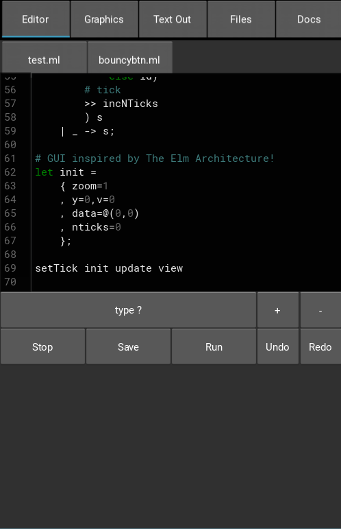
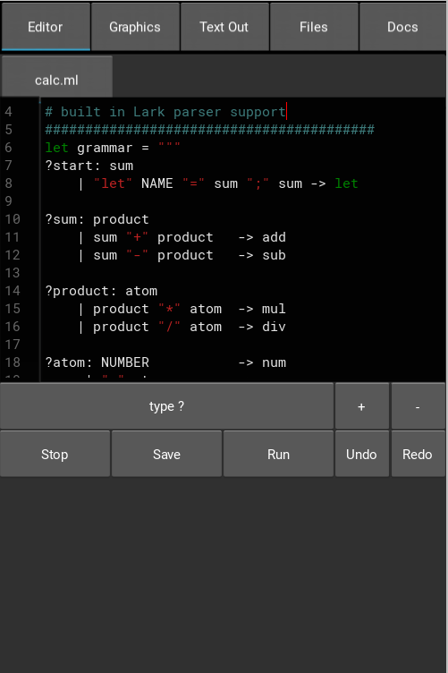
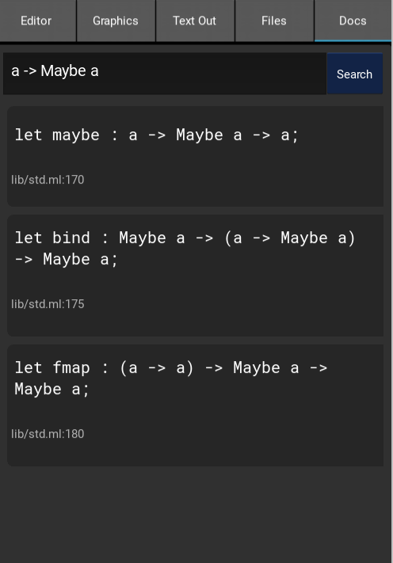
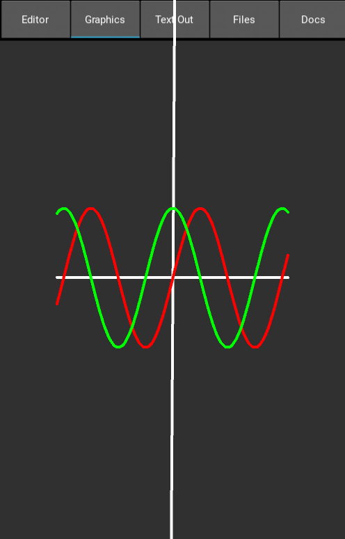

# Pocket ML 📱


PocketML is a functional statically-typed language designed for
tinkering / small projects. Its main feature is the editor android app.
Use PocketML to kill boredom while waiting for the bus
or during a boring lecture! The language is similar to Standard-ML
and has python-interop, as well as support for numpy and kivy GUI. I recommend using the AnySoftKeyboard app, to make navigating code and inserting tabs easier.
<br><br>To see the app in action scroll down to the demos / gallery or download the APK from the bin/ folder.

## Specifications

> Section 1 may not be very helpful to you,
it serves mainly as an overview of the
details of the Language. To get into
PocketML, skip to section 2 (The Language Guide)!

#### 1.1 Syntax
> The syntax of the features of
PocketML is detailed in section 2 using examples.

PocketML`s syntax is largely based on Standard-ML
and Haskell. Some quirks include:
- Separation of top-level statements using `;`
```sml
let a = 10;
let b = 20;
print (a + b)
```
- Comments using `#`
```python
# i am a comment
```

#### 1.2 Type system

PocketML has a set of builtin types:
Vec (numpy arrays), Number, String, Bool, Tuples,
Lists, Dict and Maybe. Num is an alias for Number and will replace it eventually.

The operators *, /, +, - support
addition of strings, numbers, and Vecs,
as long as both sides of the operator
have the same type. The ° operator acts the
same as *, but allows two different types to
be multiplied (i.e. vector-scalar multiplication,
string multiplication, etc.).

<table border=3>
<tr><td>Operator</td><td>Type</td></tr>
<tr><td>+,-,*,/</td><td>a -> a -> a</td></tr>
<tr><td>°</td><td>a -> b -> a</td></tr>

<tr><td>composition operators:</td></tr>
<tr><td><<</td><td>(y -> z) -> (x -> y) -> (x -> z)</td></tr>
<tr><td>>></td><td>(x -> y) -> (y -> z) -> (x -> z)</td></tr>
<tr><td>$</td><td>(x -> y) -> x -> y</td></tr>

<tr><td>logical operators / equality:</td></tr>
<tr><td>&&, ||</td><td>Bool -> Bool -> Bool</td></tr>
<tr><td><=, >=, <, ></td><td>Number -> Number -> Bool</td></tr>


</table>

#### 1.2.1 Builtins:

<table border=3>
<tr><td>Function</td><td>Type</td></tr>
<tr><td>and,or</td><td>Bool -> Bool -> Bool</td></tr>
<tr><td>add,sub,mul,pow</td><td>Number -> Number -> Number</td></tr>
<tr><td>sqrt, inc, dec</td><td>Number -> Number</td></tr>
<tr><td>True, False</td><td>Bool</td></tr>
<tr><td>equal</td><td>a -> a -> Bool</td></tr>
<tr><td>lt</td><td>Number -> Number -> Bool</td></tr>
<tr><td>print</td><td>a -> ()</td></tr>
<tr><td>print2</td><td>a -> b -> ()</td></tr>
</table>

## Language Guide

#### 2.1 Data Types
PocketML uses Sum types like most other statically 
typed functional languages:
```haskell
data Maybe a
    | Just a
    | Nothing
```

Type aliases can be used to abbreviate
the names of other data types:
```sml
type Mb a = Maybe a;
```

#### 2.2 Branching
Pattern matching is based on the `case` keyword
and can match basic data types:
```sml
case 1
    | 1 -> "One"
    | _ -> "Something else"
```
And many other structure (except for numpy arrays):
```sml
case Just 1
    | Just x -> print x
    | Nothing -> ()
```

Use if-then-else for branching:
```sml
let f x = if x then "True!" else "false :(";
f True
```
When programming with side effects, an else branch may
not be needed. The if-then expression must always return
Unit.
```sml
let f : Bool -> Unit;
let f b = if b then print "True!";
...
```

#### 2.3 Do-Syntax
When many functions need to be
executed one after another, for example
to cause side effects, the do-syntax
can be used.
```haskell
let f _ = do
    print "1"
    print "2"
    print "3"
    launch_missiles ()
;
```
>Note: Do not confuse this do syntax
with monadic do-notation in Haskell! This is more of a C-like block (e.g. `{ ...; ...; }`).
The do-syntax is not perfect and might
fail to parse in some situations. When in
doubt use `let _ = a (); let _ = b (); ...`

#### 2.4 Lists
Lists can be created like in the following example:
```python
import std;

print [1, 2, 3]
# => (Cons 1 (Cons 2 (Cons 3 Nil)))
```

Numpy arrays can be created using the `@(x1, x2, x3, ...)` syntax:
```python
print (@(1, 2) + @(3, 4)) # => [4. 6.]
```
They have type `Vec`.

#### 2.5 Tuples and Records
PocketML supports both tuples and records. It is
best to use records and tuples sparingly,
as custom data types carry more information
and are more strongly typed.
```sml
type Point = (Number, Number);

type Person =
    { name: String
    , age: Number
    , location: Point };
```

> Note that PocketML does not support tuple and record pattern
matching yet!

Records also support a sort of weak row-polymorphism.

```sml
let getX : { x : a } -> a;
let getX r = r.x;

print $ getX {x=10, y=20}
```

Generally a record `{x : a, y : b}` and a record `{y : b}` unify. That also means that the following example only fails at runtime.
```sml
let getX : { x : a, y : b } -> a;
let getX r = r.x;

print $ getX {y=20}
```

> Note: The section _Python Interop_ has an example of how this can be used to implement named default arguments.

The standard library `lib.std` has functions for updating records:
```sml
import lib.std;

let myrec = {x=1,y=2,z=3};

do
    print (with { x = 22 } myrec)
    print (recordMap (\r -> with {x=r.x+1} r) myrec)
```

#### 2.6 Functions, recursion and let
Variables are generally introduced using the `let`
keyword. Let declarations can be used to introduce
a variables type before defining it:
```sml
let pi : Number;
let pi = 3;
```

Functions can be introduced using `\` and are
anonymous. To create recursive functions, 
the `rec` keyword or an explicit type
annotation is required:

```sml
let rec sum = \x -> case x
    | Nil -> 0
    | Cons x xs -> add x (sum xs);

print (sum [1,2,3,4])
```
Or alternatively:
```sml
let sum : (List Number) -> Number
let sum = \case
    | Nil -> 0
    | Cons x xs -> add x (sum xs);

print (sum [1,2,3,4])
```
>Note: The above example uses the `\case` notation
which is equivalent to `\x -> case x ...`.

Functions can also be introduced using let:
```
let greet x = print2 "Hello," x;
greet "there!"
```


#### 2.7 Modules
PocketML projects are organized into modules.
A module exports variables, types and type aliases.
The explicit module declaration can limit what is exported:

```sml
let greet x = print2 "Hi," x;
let pi = 4;
module (greet, pi)
```
Modules can also use `(*)` to export _all_
types and variables.

```sml
let greet x = print2 "Hi," x;
let pi = 4;
module (*)
```
Modules inside a directory can be addressed using `.`:
```python
import directory.mymodule;
```

#### 2.8 Python interop
PocketML is an interpreted language based on python. It
has access to most features of python and the
libraries `numpy`, `pygments`, `lark`, and `kivy`.
Python code can be included in PocketML code using
`%%% ... %%%`. PocketML uses the `PML_[varname]` naming scheme internally. Python functions exported to PocketML should be named accordingly.

```sml
%%%
def half(x):
    return x / 2

PML_half = half
%%%;

let half : Number -> Number;

print (half 2)
```

Python code can also be used to compute values
in PocketML code using the inline `%% ... %%` syntax.
Python types are largely compatible with PocketML types.
```sml
print %%f"PocketML does not have f-strings but python does {'!'*10}"%%
```
Another example:
```python
import lib.std;

# get name and greet!
input "Name:" (\nm -> print %%f"Hi, {PML_nm}!"%%)
```

As discussed in the sections on _records_, one can also build a function with default arguments using python interop:

```sml
let mkVec : { x : Number, y : Number, z : Number } -> Vec;

%%%
def PML_mkVec(r):
    defaults = {"x":0,"y":0,"z":0}
    defaults.update(r)
    return np.array(list(defaults.values()))
%%%;
```
```python
print $ mkVec {y=20} # => [ 0 20  0]
```

#### 2.9 The editor

##### GUI
A large part of PocketML is its editor.
Use the `Editor` tab in the top toolbar
to edit files. Close files by long pressing the
file tab. Results show up in either
the `Graphics` tab for graphics or the `Text Out`
tab for text output. The info box above the keyboard shows the type
of the symbol the cursor is on when clicked (no live type checking yet,
because the typechecker is too slow). Manage project files and directories
in the `Files` tab. For advanced file management
use a File manager app that can access the
`InternalStorage/Android/data/org.myapp.test/files/`
directory.

##### Extending and hacking!
PocketML`s editor is accessible to PocketML by using python interop.
Use the following template to gain access to
the editor object. It contains the "terminalout"
and "graphicalout" objects.
```python
%%
EDITOR = globals()["editor"]

def cls(_):
    # example usage:
    # clear the terminal
    global EDITOR
    EDITOR.terminalout.text = ""
%%;
()
```
For a better insight into accessing the editor from code,
refer to the `graphics.ml` library.

If you want to build your own version of the app, use buildozer.

## Demo
https://github.com/user-attachments/assets/f015ab1a-d928-4113-b359-936a0ff46a2f


## Gallery

<table>
<tr>
<td></dr>
<td> </dr>
</tr>

<tr>
<td> Hoogle-like search </dr>
<td> Builtin graphics primitives </dr>
</tr>

</table>
