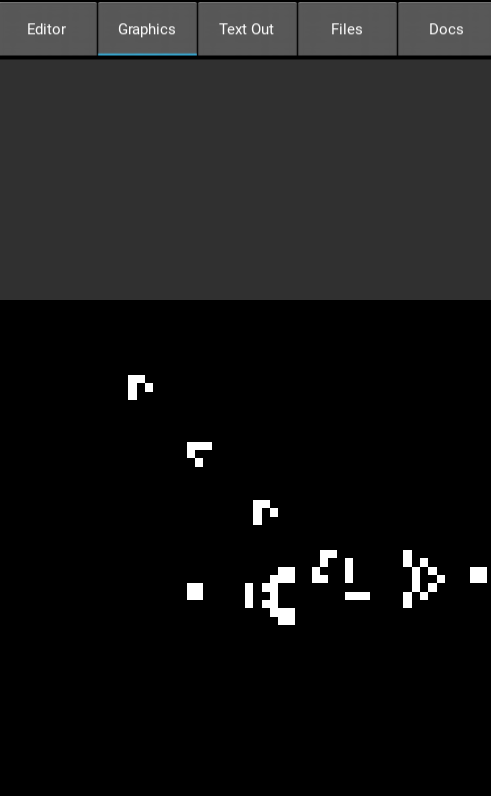

## Walkthrough: Coding Game of Life in PocketML

#### 1.1 Conways Game of Life
I think most people in this space are familiar with Game of Life, but heres a quick overview:

Conways Game of Life is a grid based simulation of cells. They can die, live or come to life. The rules are very simple but give rise to emergent organic-looking behaviour. Game of Life is actually Turing complete.


The rules are as follows:
- A cells stays alive and/or gets born when it has three alive neighbours
- A cell dies when it has more or less than 3 neighbours.

#### 1.2 Setup in PocketML
First we'll need some libraries:
```python
import lib.std;
import lib.image;
import lib.math;
import lib.tea;
```
We will represent the playing grid as a small image. Let's start with
a 60x60 grid. We can create an image by calling the `image` function
with a vector that denotes the size (`@(width, height)`):
```
let w = 60;
let i = image @(w,w);
```
> Note: I left out the types. PocketML can infer them. If you
> were to click on the typing-button in the editor with the
> cursor on our image `i`, you would get `i : Img`.

#### 1.3 Checking neighbouring cells
To determine if a cell should live or die, we need to know the number of
living neighbours. To access the neighbours we will use offsets from the
position of the cell we want to check:
```
let offsets = [
    @(-1,-1),@(0,-1), @(1,-1),
    @(-1,0),@(1,0), # The middle row has only two cells, because
    # we do not want to count the cell itself.
    @(-1,1),@(0,1),@(1,1)
];
```

To get all the neighbouring pixels/cells we will map over the offsets:
```python
map (\offset ->
    let p = imgGet buf (v + offset); # v + o is vector addition!
    # Out of bounds access to an image returns the empty vector.
    if vecLen p == 0 then 0 else
    vecAt 0 p)
offsets
```

Now we can filter them to only get the live cells and then count them using `len`.
Let's also wrap the entire thing in a function:
```sml
let nAlive buf v =
	let offsets = [
		@(-1,-1),@(0,-1),@(1,-1),
		@(-1,0),@(1,0),
		@(-1,1),@(0,1),@(1,1)
	];
	
	len (filter (\x -> x > 0) $
		map (\o ->
			let p = imgGet buf (v+o);
			if vecLen p == 0 then 0 else
			vecAt 0 p)
		offsets);
```

#### 1.4 Updating the cells
We can write the rules from above as a function:
```sml
let determineAlive : Bool -> Number -> Bool;
let determineAlive c n =
	if c then not (n < 2 || n > 3)
	else (n == 3)
;
```

Now we can copy our image to a buffer for fast read access and map over every pixel
using `imgMap` from lib.image. We'll color live pixels white and dead ones black.
> Note: This mutates our image, which is a sin in
> functional languages, but we'll go with it to
> increase performance
```
let tick img =
	# save the image in a buffer, to
	# stop neighbours from being
	# overwritten.
	let buf = imgBuf img;
	imgMap img (\x y cell ->
		let n = nAlive buf @(x,y);
		let c = vecAt 0 cell > 0;
			if determineAlive c n
			then @(255,255,255,255)
			else @(0,0,0,255)
    );
```

#### 1.5 Populating our playing grid
We could have loaded our image from a file using `imgLoad`. Alternatively we
can make a function to add cell patterns from a 2D list:
> Note: imap <=> "map with index". This is similar to/inspired by a for
> loop with enumerate in python.
> The builtin `map` functions are also fast because they use python for loops
> internally.
```
let addPattern img v p=imap (\y l-> imap # rows
	(\x c-> setpixel img (v+@(x,y)) # columns
		(@(c,c,c,255) ° 255)
	) l) p;
```

#### 1.6 Running the app / Event loop
Because we want to actually see the game, we need to build a GUI.
We need `update`, the initial state and `view` like in ELM.
Let's count the ticks since the app started to slow down the
games tick/update rate a little:
> Note: Our state is `Number` in this case (the number of ticks)!
> We'll increase (`inc`) it every frame.
```sml
let update : Event -> Number -> Number;
let update e t = case e
    | Tick -> do
        when (divisible t 5) (\_ -> tick i)
        inc t
;
```

The playing field will be displayed using a textured rectangle (`TRect`).
```sml
let view _ = TRect @(0,0) @(width,width) i;
```

Now we can start the app using `setTick`:
```sml
setTick 0 update view
```


#### 1.7 End result
I have added a gosper glider gun:
```sml
let _ = do
	addPattern i @(15, 20) gosper
;
```
`gosper` is a really big list, so you'll have to see the source code (gol.ml)
for the details :).


