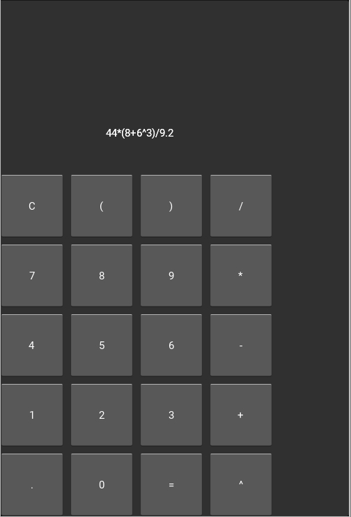

## Walkthrough: Coding a GUI calculator in PocketML

This walkthrough shows the core functionality of `lib.tea`.

#### 1.1 TEA-architecture
The Elm Architecture (TEA) is a GUI architecture that decouples
the app logic (`tick`), visuals/GUI (`view`) and initial state (`init`).
The essential data types for TEA in PocketML are:

| | |
| - | - |
| `Widget` | GUI components like buttons, text or simple shapes/sprites |
|`Event`|When a button is pressed or a frame is rendered, the `update` function receives an event.|

#### 1.2 Evaluating expressions
Our calculator will have to calculate an expression from a string. PocketML does include an example with an expression evaluator, but in this case we'll use python interop:

```python
%%%
def PML_eval(s):
	try:
		return str(round(eval(s),4))
	except ZeroDivisionError:
		return "error: division by zero"
%%%;
let eval : String -> String;
```

#### 1.3 State / Logic
Our calculator will have buttons and
a text display that shows the current expression. When the "=" button is pressed, the text display will show the result of the calculation. So our state will just be a String.

```sml
type State = String;
let init = "";
```

To update our state we will use a tick function, that react to the button events. When "C" (clear) is pressed, the state will become the empty string. When "=" is pressed, the result of the expression is written into the state. When another button is pressed and that button happens to be a valid calculator button, the button text will be added to the state.
> Note: We also have to include a default case! lib.tea automatically skips rerendering frames when the state didn't change. The core assumption is that the `view` function is pure. Updates can be forced by using `forceUpdate state` in the default case of `tick`.

```sml
let tick : Event -> State -> State;
let tick e s = case e
	| BtnPressed "=" ->
		eval (replace "^" "**" s)
	| BtnPressed "C" -> ""
	| BtnPressed x ->
		if isNumeric x || strIn x "()+-*/^."
		then s+x
		else s
	| _ -> s;
```

#### 1.4 Making the UI layout
Our view includes buttons and the state text. Buttons accept a text _and_ a name, similar to `id` in html. It is used for UI-diffing in the backend and also the argument of `BtnPressed` in our `tick` function.
> Note: We could write make all the buttons manually. Instead we will write a 1D list of button labels and then place / create the buttons based on the index in the list.

```sml
let mkBtn w n t =
	let pos = @(n-4*int (n/4), 4-int (n/4)) ° w;
	Btn t t pos @(w*.9,w*.9);
```

Our button layout is:
```sml
let btnLayout = [
	"C", "(", ")", "/",
	"7", "8", "9", "*",
	"4", "5", "6", "-",
	"1", "2", "3", "+",
	".", "0", "=", "^"
];
```

#### 1.5 View
Putting it all together we can generate a view that includes both the buttons and a label with the current expression text:

> Note: The Many widget is similar to a html div. It allows us to return multiple widgets from the view. They can also be nested.

```sml
let view : State -> Widget;
let view s =
	let w = width/5;
	let btns = Many (imap (mkBtn w) btnLayout);
	let inp = Label s "inp" @(0,w*5) @(w*4,w);
	Many [inp, btns];
```

#### 1.6 Running the app
`lib.tea` apps can be launched as follows:

```sml
setTick init tick view
```


#### 1.7 Gallery / Results

> Note: This screenshot is from linux, on android the layout or font might change a little depending on your kivy installation / android version.

Kivy labels don't have background by default. As an exercise you could add a `Rect pos size color` behind the label inside `view`!
